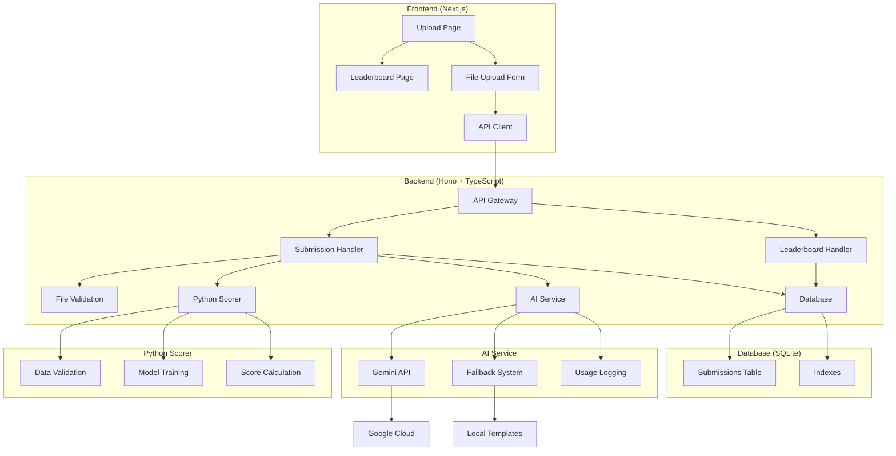

# Architecture Documentation

## System Overview

The MachineHack Iris Classification Challenge is a full-stack application that allows users to upload CSV files containing Iris classification predictions, receive AI-generated feedback, and compete on a leaderboard.

## Architecture Diagram



## Component Architecture

### Frontend (Next.js 14)

**Technology Stack:**
- Next.js 14 with App Router
- TypeScript for type safety
- Tailwind CSS for styling
- shadcn/ui for component library

**Key Components:**
- `UploadPage`: File upload interface with form validation
- `LeaderboardPage`: Real-time leaderboard display
- `UI Components`: Reusable components from shadcn/ui

**State Management:**
- React hooks for local state
- API calls for server state
- No external state management library (kept simple)

### Backend (Hono + TypeScript)

**Technology Stack:**
- Hono for lightweight, fast API server
- TypeScript for type safety
- SQLite with Drizzle ORM
- Google Gemini AI integration

**API Design:**
- RESTful endpoints
- JSON request/response format
- Proper HTTP status codes
- CORS configuration for frontend

**Key Services:**
- `ScoringService`: Handles Python scorer communication
- `AIService`: Manages AI feedback generation
- `DatabaseService`: Handles data persistence

### Python Scorer

**Technology Stack:**
- Python 3.8+
- scikit-learn for ML operations
- pandas for data manipulation
- JSON for API communication

**Scoring Algorithm:**
1. Load and validate CSV data
2. Train baseline RandomForest model
3. Calculate accuracy and F1 score
4. Combine scores: 0.7 × Accuracy + 0.3 × F1
5. Generate detailed feedback

### Database Schema

**Submissions Table:**
```sql
CREATE TABLE submissions (
  id INTEGER PRIMARY KEY AUTOINCREMENT,
  username TEXT NOT NULL,
  score REAL NOT NULL,
  feedback TEXT NOT NULL,
  file_name TEXT NOT NULL,
  file_size INTEGER NOT NULL,
  created_at DATETIME DEFAULT CURRENT_TIMESTAMP
);
```

**Indexes:**
- `idx_submissions_score`: For efficient leaderboard queries
- Composite index on (score DESC, created_at ASC)

## Data Flow

### Upload Flow

1. **User uploads file** → Frontend validates file type and size
2. **Form submission** → API receives multipart form data
3. **File validation** → Backend validates CSV format and content
4. **Python scoring** → Spawns Python process to calculate score
5. **AI feedback** → Generates feedback using Gemini API or fallback
6. **Database storage** → Stores submission with score and feedback
7. **Response** → Returns success with submission details

### Leaderboard Flow

1. **Page load** → Frontend requests leaderboard data
2. **Database query** → Backend queries top 10 submissions
3. **Data formatting** → Adds ranking and formats timestamps
4. **Response** → Returns leaderboard entries

## Security Considerations

### Input Validation
- File type validation (CSV only)
- File size limits (10MB max)
- Username sanitization
- SQL injection prevention via ORM

### Error Handling
- Graceful error responses
- No sensitive information in errors
- Proper HTTP status codes
- Client-side error boundaries

### AI Usage Logging
- All AI interactions logged
- Prompt and response tracking
- Mode switching (live/fake)
- Privacy-conscious logging

## Performance Optimizations

### Database
- Indexed queries for leaderboard
- Efficient pagination
- Connection pooling

### Frontend
- Static generation where possible
- Optimized bundle size
- Lazy loading for components

### Backend
- Lightweight Hono framework
- Efficient file handling
- Async operations

## Scalability Considerations

### Current Limitations
- Single SQLite database
- Synchronous processing
- No authentication system

### Future Improvements
- PostgreSQL for production
- Queue system for async processing
- User authentication and sessions
- Horizontal scaling with load balancers

## Monitoring and Logging

### Application Logs
- Structured logging with timestamps
- Error tracking and alerting
- Performance metrics

### AI Usage Tracking
- Detailed prompt/response logging
- Usage analytics
- Cost monitoring

## Deployment Architecture

### Development
- Local development servers
- Hot reloading enabled
- Debug logging

### Production (Vercel)
- Serverless functions
- CDN for static assets
- Environment variable management
- Automatic deployments

## Technology Decisions

### Why Hono?
- Lightweight and fast
- TypeScript-first
- Modern API design
- Easy deployment

### Why SQLite?
- Zero configuration
- Perfect for MVP
- Easy local development
- Can migrate to PostgreSQL later

### Why Gemini AI?
- Good performance
- Reasonable pricing
- Easy integration
- Fallback system for reliability
